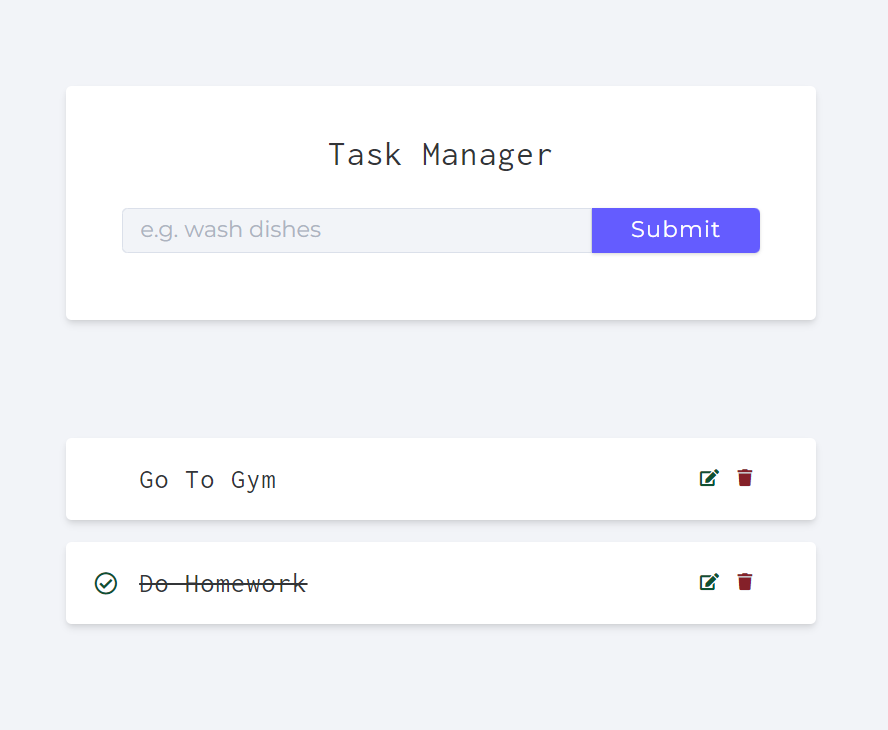

# task-manager

Building a REST API for task manager using Node.js, Express.js, and MongoDB (frontend design was made by John Smilga).

### Snapshot

### Project Setup

- Create .env file, then set MONGO_URI variable equal to DB connection string.
- Run `npm install`, then `npm start`.
